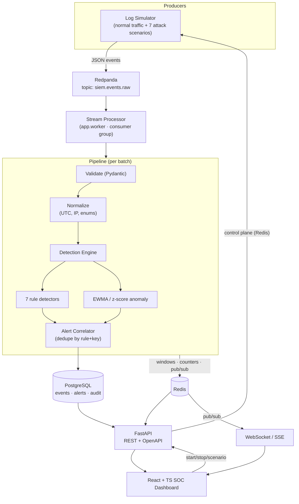

# Real-Time Distributed Enterprise SIEM Engine

A portfolio-grade distributed SIEM platform for security monitoring, detection
engineering, and real-time event analytics. It ingests high volumes of simulated
enterprise security logs through a Kafka-compatible broker, processes them
asynchronously in a dedicated stream processor, runs a modular detection engine
(deterministic rules **plus** a statistical anomaly layer), correlates findings
into alerts, persists everything to PostgreSQL, and streams live analytics to a
React/TypeScript SOC dashboard over WebSockets.

> **Not** an enterprise production SIEM. Enterprise logs are synthetic (a
> first-class simulator is part of the project), detection rules are
> demonstration rules with tunable thresholds, and the anomaly layer is a
> statistical baseline — not a tuned UEBA/IDS. See
> [Limitations](#limitations).

[](https://github.com/Veershah027/real-time-distributed-siem-engine/actions/workflows/ci.yml)


---

## Why this exists

Detection engineering and distributed-systems work are hard to demonstrate on a
laptop without a realistic, end-to-end pipeline. This project is that pipeline:

```
LOG PRODUCERS → MESSAGE BROKER → STREAM PROCESSOR → DETECTION ENGINE → ALERT
CORRELATION → PostgreSQL / Redis → FastAPI (REST + WebSocket) → React SOC DASHBOARD
```

You can start a simulated SSH brute-force attack from the dashboard and watch a
`HIGH` severity alert appear in real time, open it, see the correlated evidence
(27 failures from one IP, 42-second window), and triage it — all backed by a
real broker, real consumer group, real database, and real detection code.

## Architecture



Full detail: [`docs/architecture.md`](docs/architecture.md) ·
[`docs/adr/`](docs/adr) · [`docs/threat-model.md`](docs/threat-model.md)

## Features

- **Distributed pipeline** — producers, a Kafka-compatible broker (Redpanda), and
  a separate consumer process with a real consumer group, batched commits,
  reconnect handling, malformed-message tolerance, event-id idempotency, and
  graceful shutdown.
- **Strongly-typed event model** — permissive `RawEvent` off the wire →
  validated, normalized, immutable `SecurityEvent` (UTC timestamps, validated
  IPs/ports, bounded strings & metadata, unknown enums funnelled safely).
- **Modular detection engine** — every detector implements one interface; state
  lives in Redis sliding windows so the engine scales across workers.
- **7 deterministic rules** — SSH brute force, password spraying, port scan,
  privilege escalation, suspicious SQL, data exfiltration, authentication
  anomaly. Thresholds are environment-configurable.
- **Statistical anomaly layer** — per-minute EWMA mean/variance + z-score with an
  explainable `anomaly_reason`. Optional Isolation Forest behind
  `SIEM_ENABLE_ML`.
- **Alert correlation** — N events from one attack collapse into one alert with
  `event_count`, `first_seen`/`last_seen`, involved users/hosts, and capped
  evidence.
- **Alert triage API** — `OPEN → ACKNOWLEDGED → RESOLVED / FALSE_POSITIVE` with a
  validated state machine and an audit trail.
- **Real-time dashboard** — WebSocket-fed SOC console: live event stream, alert
  feed, summary cards, and charts (events/alerts over time, severity mix, top
  IPs, event types). No polling for the live views.
- **Simulator control panel** — start/stop, rate slider, scenario picker,
  attack-ratio, burst mode — all from the dashboard.
- **Pluggable threat-intel enrichment** — deterministic synthetic provider by
  default; fully offline; no API keys required.
- **Observability** — structured JSON logs; Prometheus exposition on the API
  (`:8000/metrics`) and the stream processor (`:9109/metrics`, where the
  pipeline/detection counters and latency histograms live); example scrape
  config in `infrastructure/configs/`.
- **Security hardening** — input validation, Redis-backed rate limiting, security
  headers, restricted CORS, request IDs, non-root containers, pinned deps,
  Bandit + pip-audit in CI.

## Technology stack

| Layer | Tech | Purpose |
|---|---|---|
| Broker | **Redpanda** (Kafka API) + `aiokafka` | event streaming, consumer group |
| Stream processor | Python 3.12, asyncio | validate → detect → persist → alert |
| API | **FastAPI**, Pydantic v2, Uvicorn | REST + WebSocket + OpenAPI |
| Storage | **PostgreSQL 16**, SQLAlchemy 2 (async), Alembic | durable events/alerts/audit |
| Real-time state | **Redis 7** | sliding windows, counters, pub/sub |
| Detection | custom engine + `scikit-learn` (optional) | rules + anomaly + optional ML |
| Frontend | **React 18**, TypeScript, Vite, Tailwind, Recharts, React Query | SOC dashboard |
| Simulator | Python, asyncio | synthetic enterprise logs + attacks |
| Infra | **Docker**, Docker Compose | one-command local stack |
| CI/CD | **GitHub Actions** | lint, types, tests, security, image build, compose smoke |
| Quality | Ruff, mypy, Bandit, pip-audit, pytest + coverage, ESLint, Vitest | |

## Getting started

### Prerequisites

- Docker Desktop (Compose v2) — the only hard requirement for the full stack
- For local dev outside containers: Python 3.11+, Node 22+

### Run the whole platform

```bash
git clone https://github.com/Veershah027/real-time-distributed-siem-engine.git
cd real-time-distributed-siem-engine
cp .env.example .env
docker compose up --build
```

Then open:

| URL | What |
|---|---|
| http://localhost:8080 | SOC dashboard |
| http://localhost:8000/docs | API (Swagger UI) |
| http://localhost:8000/health/ready | component readiness |
| http://localhost:8000/metrics | Prometheus metrics (API) |
| http://localhost:9109/metrics | Prometheus metrics (stream processor) |

The `simulator` service auto-starts in `mixed` mode, so events and the occasional
alert appear within ~15 seconds.

### Common commands

```bash
docker compose up --build            # start everything
docker compose down                  # stop
docker compose down -v               # stop + wipe volumes (reset)
docker compose logs -f worker        # follow the stream processor
docker compose ps                    # service health

# drive a specific attack on demand (one-shot):
docker compose run --rm simulator --once ssh_brute_force
docker compose run --rm simulator --once port_scan

# migrations
docker compose exec backend alembic upgrade head
docker compose exec backend alembic downgrade -1
```

### Local development (no rebuilds)

```bash
docker compose -f docker-compose.yml -f docker-compose.dev.yml up   # hot-reload backend
cd frontend && npm install && npm run dev                            # Vite on :5173
```

## Simulator

Synthetic, offline, defensive. It never touches a real host or network — every
IP is drawn from `TEST-NET` documentation ranges or RFC 1918 space.

```bash
python -m simulator --rate 500                       # continuous normal traffic
python -m simulator --scenario ssh_brute_force       # continuous dedicated attack
python -m simulator --scenario mixed --attack-ratio 0.1
python -m simulator --once port_scan                 # single attack instance
python -m simulator --rate 200 --sink console        # JSON lines, no broker
```

Traffic profiles: low (`--rate 10`), normal (`--rate 100`), high (`--rate 1000`),
stress (`--rate 5000+`, hardware permitting), plus **burst** mode (10× for 8s)
from the dashboard.

Scenarios: `ssh_brute_force`, `port_scan`, `credential_attack`,
`privilege_escalation`, `data_exfiltration`, `sql_attack`, `web_attack`, `mixed`.

## API

`GET /health` · `GET /health/ready` · `GET /api/events` · `GET /api/events/{id}`
· `GET /api/alerts` · `GET /api/alerts/{id}` · `GET /api/alerts/{id}/events` ·
`PATCH /api/alerts/{id}` · `GET /api/metrics` · `GET /api/metrics/timeseries` ·
`GET /api/threats/top-ips` · `GET /api/threats/event-types` ·
`GET /api/threats/enrich/{ip}` · `GET /api/detections` · `GET /api/detections/{id}`
· `GET /api/system/status` · `POST /api/simulator/start|stop|configure` ·
`GET /api/simulator/status` · `GET /ws` (WebSocket) · `GET /api/sse` ·
`GET /metrics` (Prometheus).

Interactive docs at `/docs`; schema at `/openapi.json`.

## Detection rules

| Rule | Name | Trigger (default) | Severity |
|---|---|---|---|
| RULE-001 | SSH/service brute force | > 10 auth failures from one IP in 60s | HIGH (CRITICAL if a login then succeeds) |
| RULE-002 | Password spraying | one IP vs > 8 distinct usernames in 120s | HIGH |
| RULE-003 | Port scanning | one IP → > 20 unique dest ports in 30s | HIGH |
| RULE-004 | Privilege escalation | non-privileged user runs admin action / off-hours / explicit event | HIGH |
| RULE-005 | Suspicious database activity | injection / exfil patterns in synthetic SQL logs | MEDIUM–HIGH |
| RULE-006 | Excessive outbound traffic | > 50 MiB outbound per src→dst in 60s | MEDIUM–HIGH |
| RULE-007 | Authentication anomaly | one account from > 4 distinct IPs in 300s | MEDIUM–HIGH |
| ANOM-001 | Statistical anomaly | per-minute metric > z-threshold σ from EWMA baseline | MEDIUM–HIGH |
| ML-001 | Isolation Forest outlier | optional; `SIEM_ENABLE_ML=true` | MEDIUM |

Every threshold is an environment variable — see [`docs/detection-rules.md`](docs/detection-rules.md).

## Anomaly detection

`detection/anomaly.py` maintains an exponentially-weighted mean and variance per
metric (events/min, auth failures/min, outbound MiB/min, DB errors/min, …) in
Redis. A reading is anomalous when `|z| ≥ SIEM_ANOMALY_ZSCORE_THRESHOLD` and at
least `SIEM_ANOMALY_MIN_SAMPLES` observations exist. Output includes
`anomaly_score` (0–1) and a human `anomaly_reason`. It is deliberately simple and
explainable; the interface is narrow so an ML model can replace it. See
[`docs/detection-rules.md#anomaly`](docs/detection-rules.md).

## Testing

```bash
# backend unit tests (no infra needed — fakeredis)
cd backend && pip install -e ".[dev]" && pytest -m "not integration"

# full suite incl. integration (needs Postgres + Redis)
docker compose up -d postgres redis
SIEM_RUN_INTEGRATION=1 pytest

# simulator
cd simulator && pip install -e ".[dev]" && pytest

# frontend
cd frontend && npm install && npm test && npm run build
```

CI runs Ruff, mypy, Bandit, pip-audit, the full pytest suite with coverage
(`--cov-fail-under=75`), the simulator tests, ESLint + `tsc` + Vitest + the Vite
build, all three Docker image builds, and a **compose smoke test** that boots the
whole stack and asserts a brute-force scenario produces an alert.

## Security

This is a defensive security education project. See [`SECURITY.md`](SECURITY.md)
and [`docs/threat-model.md`](docs/threat-model.md). Highlights: no secrets in the
repo (`.env.example` only), non-root containers, pinned dependencies, input
validation and rate limiting, restricted CORS, security headers, and an audit log
for analyst actions. The attack simulator is synthetic and local-only.

## Performance

`benchmarks/throughput.py` drives the simulator and reads the worker's own
Prometheus counters (`http://localhost:9109/metrics`) to report **actual**
measured numbers — nothing is asserted or assumed. Results depend entirely on
hardware and Docker configuration.

```bash
docker compose up -d
python benchmarks/throughput.py --duration 30 --rate 2000
```

One reference run (Windows 11 laptop, Docker Desktop / WSL2, target 2000 eps,
`--scenario mixed`, 30 s window):

| metric | value |
|---|---|
| events consumed & persisted | 20,000 (≈ 667/s sustained) |
| invalid events | 0 |
| mean pipeline latency (consume → persisted) | 1.71 ms/event |
| mean detection-engine latency (7 rules) | 0.58 ms/event |

The single-container simulator is the ceiling here (~400–670 eps effective on
this box); the pipeline itself has substantial headroom. **Your numbers will
differ** — run the benchmark on your own hardware.

## Limitations

- Enterprise logs are **synthetic** (the simulator is intentional project scope).
- No real endpoint agents, netflow, or packet capture.
- Threat-intel enrichment is a deterministic synthetic provider by default.
- Detection rules are demonstration rules, not a tuned production ruleset.
- The anomaly layer is a statistical baseline, not a production IDS/UEBA.
- Optional LLM assist (off by default) only summarizes alerts; it never overrides
  a detection.
- Local Docker Compose is a single-node convenience topology, not a production
  deployment.

## Roadmap

- Consumer-lag metric from the Redpanda admin API on the System page
- Parquet cold storage + retention job for `security_events`
- Detector unit-test fixtures generated from recorded scenario captures
- Grafana dashboards wired to `/metrics`
- Rule hot-reload from the `detection_rules` table

## Resume highlights

See [`README` § below](#resume-highlights-verified) — bullets are written only
from functionality that is implemented and covered by tests.

### Resume highlights (verified)

- Built a distributed SIEM pipeline in Python — Redpanda (Kafka API) + `aiokafka`
  consumer group → asyncio stream processor → PostgreSQL/Redis — that validates,
  normalizes, and detects on batched security events with idempotent persistence
  and graceful shutdown.
- Designed a modular detection engine with 7 deterministic rule detectors (SSH
  brute force, password spraying, port scan, privilege escalation, suspicious
  SQL, data exfiltration, auth anomaly) backed by Redis sliding-window state,
  plus an explainable EWMA/z-score anomaly layer and optional Isolation Forest.
- Implemented alert correlation that collapses many attack events into a single
  alert with evidence, `first/last_seen`, and `event_count`, exposed through a
  FastAPI REST + WebSocket API with a validated triage state machine and audit
  logging.
- Delivered a React/TypeScript SOC dashboard (live event stream, alert triage,
  time-series and severity charts, simulator control) and containerized the whole
  platform with Docker Compose, with GitHub Actions running lint, type checks,
  Bandit/pip-audit, a coverage-gated pytest suite, and an end-to-end compose
  smoke test.

## License

MIT — © 2026 Veer Shah. See [`LICENSE`](LICENSE).
