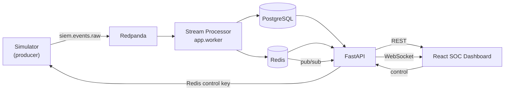
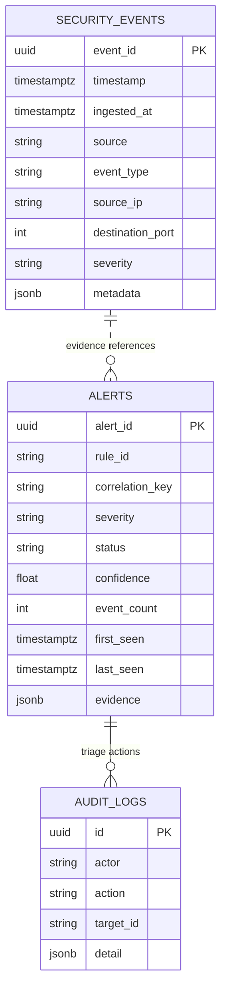

# Architecture

## 1. Overview

The platform is a set of small services connected by a Kafka-compatible event
log. Producers are decoupled from processing; processing is decoupled from the
API; the API is decoupled from the dashboard. Every hop is asynchronous.

## 2. Event flow, step by step

1. **Produce.** The simulator builds synthetic JSON events and publishes them to
   the `siem.events.raw` topic (key = source IP, for partition locality). The
   topic has 6 partitions so the consumer group can parallelize.
2. **Consume.** `app.worker` runs an `aiokafka` consumer in group
   `siem-stream-processor` with `enable_auto_commit=False`. It pulls batches
   (`getmany`, up to `SIEM_CONSUMER_BATCH_MAX`).
3. **Validate.** Each record is parsed into `RawEvent` (permissive) then
   `SecurityEvent.from_raw` (strict, immutable). Failures increment
   `siem_events_invalid_total{reason="validation"}` and are dropped — a hostile
   or buggy producer cannot crash the consumer.
4. **Normalize.** UTC timestamps (with future-skew clamping), validated IPs and
   ports, length-bounded strings, size-bounded metadata, unknown enum values →
   `unknown`.
5. **Deduplicate.** Event IDs are checked against a Redis set
   (`siem:seen-events`, 10-minute TTL). Duplicates increment
   `siem_events_duplicate_total`. Combined with `ON CONFLICT DO NOTHING` on the
   primary key, storage is effectively-once.
6. **Detect.** `DetectionEngine.evaluate(event)` runs every detector whose cheap
   `applies_to()` pre-filter passes. Detectors are stateless; cross-event state
   (counts, unique sets, rolling sums) lives in Redis sorted sets via
   `WindowStore`. Detection latency is recorded in
   `siem_detection_latency_seconds`.
7. **Correlate.** Each `Detection` is folded by `AlertCorrelator` into an
   existing non-terminal alert for the same `(rule_id, correlation_key)`, or a
   new alert is created. Folding bumps `event_count`, `last_seen`, confidence
   (max), severity (max, never downgraded), merges involved users/hosts, and
   appends capped evidence.
8. **Persist.** Events are batch-inserted; alerts are flushed — all in one
   transaction per batch (`session_scope`). The broker offset is committed only
   after the transaction succeeds (at-least-once + idempotency).
9. **Fan out.** New events (capped per batch) and every alert are published to
   Redis pub/sub channels `siem:stream:events` / `siem:stream:alerts`. Rolling
   metrics go to `siem:stream:metrics` and Redis hashes with short TTLs.
10. **Serve.** FastAPI reads durable data from Postgres and real-time data from
    Redis. `/ws` bridges the pub/sub channels to the browser; the dashboard never
    polls for the live views.
11. **Per-minute rollup.** The pipeline aggregates each minute into a feature
    vector and feeds `StatisticalAnomalyDetector` (and optionally the Isolation
    Forest). Anomalies become `ANOM-001` / `ML-001` alerts through the same
    correlator.

## 3. Components

### Message broker — Redpanda

Kafka wire-compatible, single binary, no ZooKeeper/KRaft ceremony, ~1 GB lighter
than Apache Kafka for local dev. All code uses the standard Kafka protocol via
`aiokafka`, so switching to Apache Kafka is a bootstrap-address change. See
[`adr/0001-message-broker.md`](adr/0001-message-broker.md).

### Stream processor — `app.worker`

A standalone process (its own container, same image as the API) so ingestion and
detection scale independently of the API. Handles: bounded connect retries with
backoff, per-batch error isolation (a bad batch is logged and skipped, the loop
survives), signal-driven graceful shutdown (stop consuming → finish in-flight →
close consumer → dispose pools), and a 10-second heartbeat + active-alert gauge
refresh.

### Detection engine — `app.detection`

- `base.Detector` — the interface: `applies_to()` + `async evaluate() -> Detection | None`.
- `engine.DetectionEngine` — resolves per-rule params (defaults ← env overrides),
  runs detectors, records latency, isolates detector errors.
- `windows.WindowStore` — Redis sorted-set sliding windows: `add_and_measure`
  (count + unique set + span in one pipeline round trip), `measure`, `incr_sum`.
- `rules/*` — one file per detector.
- `anomaly.StatisticalAnomalyDetector` — EWMA mean/variance + z-score.
- `ml.IsolationForestDetector` — optional, lazily imported, no-ops when disabled.
- `correlation.AlertCorrelator` — dedupe / fold.
- `enrichment` — pluggable; synthetic provider is offline & deterministic.

### Storage

- **PostgreSQL** — source of truth. Tables: `security_events`, `alerts`,
  `detection_rules`, `hosts`, `audit_logs`, `users`. Async SQLAlchemy 2.0 +
  asyncpg. Alembic migrations. Indexes on `(timestamp desc)`, `(event_type, ts)`,
  `(source_ip, ts)`, `(severity, ts)`, and alert `(status, severity, last_seen)`.
  All list endpoints are paginated (`limit ≤ 200`).
- **Redis** — ephemeral only: detector windows (TTL = window + slack), rolling
  metric hashes (~5-minute TTL), the de-dupe set, the rate-limit counters, the
  simulator control key, and pub/sub. Never the source of truth.

### API — `app.api`

FastAPI with Pydantic response models, consistent error envelope
(`{error, detail, request_id}`), OpenAPI at `/openapi.json`. Middleware:
`RequestContextMiddleware` (request IDs, security headers, timing) and
`RateLimitMiddleware` (Redis fixed-window per client IP, fails open).

### Frontend — `frontend/`

React 18 + TypeScript + Vite + Tailwind + Recharts + React Query + React Router.
One shared WebSocket via `RealtimeProvider`. Pages: Dashboard, Events, Alerts,
Detection Rules, Threat Intel, Simulator, System. Served by nginx in production,
which also reverse-proxies `/api` and `/ws` to the backend (same-origin, no
CORS).

### Simulator — `simulator/`

Independent package. `generators/normal.py` produces a weighted mix of benign
events; `scenarios/*.py` each return one complete, time-ordered attack instance.
`engine.SimulatorEngine` paces output (10 ticks/s), interleaves attack and
background traffic, honors the Redis control key, and writes heartbeat + stats
back to Redis. CLI: `python -m simulator`.

## 4. Data model

`alerts` has a unique constraint on `(rule_id, correlation_key, status)` so at
most one *open* window exists per correlation key; a resolved alert does not
block a fresh one from the same IP later.

## 5. Failure modes & handling

| Failure | Behaviour |
|---|---|
| Broker down at startup | consumer/producer retry with exponential backoff (bounded) |
| Broker drops mid-run | `getmany` catches `KafkaConnectionError`, backs off, retries |
| Malformed event | dropped, counted, logged; batch continues |
| Duplicate event | dropped via Redis set + PK conflict |
| Detector throws | caught per-detector, logged, other detectors still run |
| Batch transaction fails | offset not committed → batch retried; idempotency prevents dupes |
| Redis down | rate limiter fails open; windows/metrics degrade; pipeline logs and continues |
| SIGTERM | stop consuming → finish in-flight batch → commit → close cleanly |

## 6. Scaling notes

- More throughput → run more `worker` replicas (same consumer group; partitions
  rebalance). The topic ships with 6 partitions.
- Detector state is in Redis, not process memory, so workers are stateless and
  horizontally scalable.
- Postgres is the bottleneck for sustained very high rates; `bulk_insert` batches
  and `persist_batch_size` are tunable. Cold storage / partitioning is on the
  roadmap.
