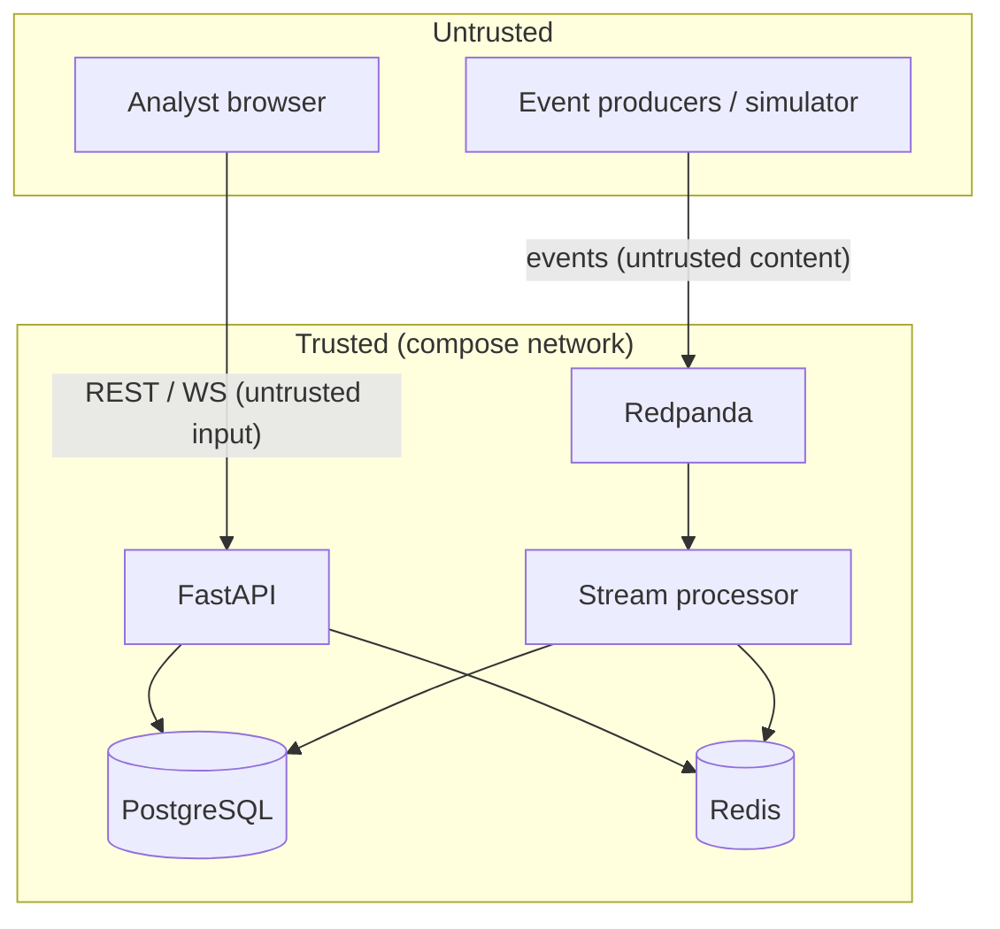

# Threat Model

Lightweight STRIDE analysis of the SIEM platform **itself** (not the enterprise
it monitors). Scope: the code and services in this repository, run as a local
Docker Compose stack or a small single-node deployment.

## System & trust boundaries

Trust boundaries: **(1)** producer → broker, **(2)** browser → API,
**(3)** any service → Redis/Postgres.

## Assets

- Integrity of stored events and alerts (detection depends on it).
- Availability of the ingestion pipeline.
- The audit log of analyst actions.
- Configuration secrets (DB password, JWT secret) — kept in env, never in the repo.

---

## S — Spoofing

| Threat | Mitigation | Residual risk |
|---|---|---|
| A rogue producer publishes fake events to the topic | Local dev: broker is bound to `127.0.0.1` only. Events are treated as **untrusted data**: validated, normalized, never executed. | No producer authentication (no mTLS/SASL) — acceptable for local/demo; documented as a hardening step for real deployments. |
| Forged API caller | Optional JWT auth (`SIEM_AUTH_ENABLED`); request IDs on every call. | Auth off by default for demo convenience. |
| WebSocket client impersonation | Same-origin nginx proxy; CORS restricted to configured origins. | Read-only channel — no state change possible over `/ws`. |

## T — Tampering

| Threat | Mitigation |
|---|---|
| Malicious event payload (huge strings, deep JSON, injection strings, bad timestamps) | `SecurityEvent` bounds string length (512 / 2048), caps metadata to 50 keys, validates IPs/ports, clamps future timestamps, funnels unknown enums. Covered by `tests/test_security.py`. |
| SQL injection via event fields or API params | 100% parameterized queries (SQLAlchemy core/ORM); no string-built SQL anywhere. RULE-005 pattern-matches query *text* but never executes it. |
| Tampering with alerts in the DB | Writes go only through the service layer; every triage action writes an `audit_logs` row (actor, from/to, request ID). |
| Container image tampering | Pinned base images by tag; pinned Python/npm dependency versions; `pip-audit` + Bandit in CI. |

## R — Repudiation

| Threat | Mitigation |
|---|---|
| Analyst denies changing an alert state | `audit_logs` records actor, action, target, before/after, request ID, timestamp, optional note. |
| Simulator control changes untracked | `set_state` records `updated_by`; API writes an audit row. |
| No per-line log signing | Out of scope; structured JSON logs with request IDs are considered sufficient for this project. |

## I — Information disclosure

| Threat | Mitigation |
|---|---|
| Stack traces leak internals | Global exception handler returns a generic message in `production` (`SIEM_ENV=production`); details only in dev. |
| Secrets in the repo / images | `.gitignore` blocks `.env`, keys, dumps; `.env.example` uses placeholders; `.dockerignore` excludes `.env`. CI has no secret-dependent steps. |
| PII in synthetic data | All data is fabricated; IPs are RFC 1918 / TEST-NET only (enforced by `tests/test_generators.py`). |
| Over-broad CORS | `SIEM_CORS_ORIGINS` allow-list; methods limited to `GET/POST/PATCH/OPTIONS`. |
| Sensitive data to an external LLM | LLM assist is **off by default**; when on, it is opt-in per alert and documented. Core detection never calls out. |

## D — Denial of service

| Threat | Mitigation | Residual risk |
|---|---|---|
| Event flood from a producer | Consumer pulls bounded batches; per-event work is O(1) amortized; Redis windows have TTLs; back-pressure is natural (unconsumed lag). | Postgres write throughput is the ceiling; documented, benchmarked, not claimed. |
| API request flood | `RateLimitMiddleware` — Redis fixed-window per client IP (`SIEM_RATE_LIMIT_PER_MINUTE`, default 240), fails open. | Fails open if Redis is down (availability chosen over strict limiting). |
| Unbounded queries / result sets | All list endpoints paginate, `limit ≤ 200`; no "fetch all". | |
| Memory growth | No unbounded in-process queues; the pipeline's minute buffer and evidence lists are capped; the WS event buffer is capped client-side. | |
| Redis/Postgres exhaustion | Redis `maxmemory` + `allkeys-lru` in compose; Postgres connection pool bounded. | |

## E — Elevation of privilege

| Threat | Mitigation |
|---|---|
| Container escape / host access | Backend, worker, simulator run as non-root users; frontend is stock nginx; images are slim; no host mounts in prod compose; ports bound to `127.0.0.1`. |
| Alert state machine bypass | Transitions validated server-side (`_ALLOWED_TRANSITIONS`); invalid moves → HTTP 409. |
| LLM overriding a detection | Architecturally impossible — the deterministic engine writes alerts; the LLM only reads them for summaries. |
| Privilege via dependency | Pinned versions; `pip-audit`; minimal dependency surface. |

---

## What this project protects against

- Malformed, oversized, or hostile **event payloads** crashing or corrupting the pipeline.
- Injection through event fields or API parameters.
- Accidental secret disclosure via the repo or images.
- Unbounded queries and basic request floods.
- Silent, unattributable changes to alert state.

## What it does **not** protect against

- A compromised broker or a network attacker between services (no mTLS/SASL in the default topology).
- A malicious operator with shell access to the host or containers.
- Nation-state-grade evasion of demonstration detection rules.
- Real-world attack techniques not represented by the simulator.
- Anything requiring real endpoint telemetry, EDR, or netflow.

## Hardening checklist for a non-local deployment

- [ ] Enable SASL/mTLS on Redpanda; authenticate producers.
- [ ] `SIEM_AUTH_ENABLED=true`, strong `SIEM_JWT_SECRET`, real user store.
- [ ] TLS termination in front of the API and dashboard.
- [ ] Secrets from a manager (not `.env`).
- [ ] Network policies between services; drop `127.0.0.1` port binds for real ingress.
- [ ] Postgres backups + retention/partitioning for `security_events`.
- [ ] Centralized log shipping for the SIEM's own logs.
